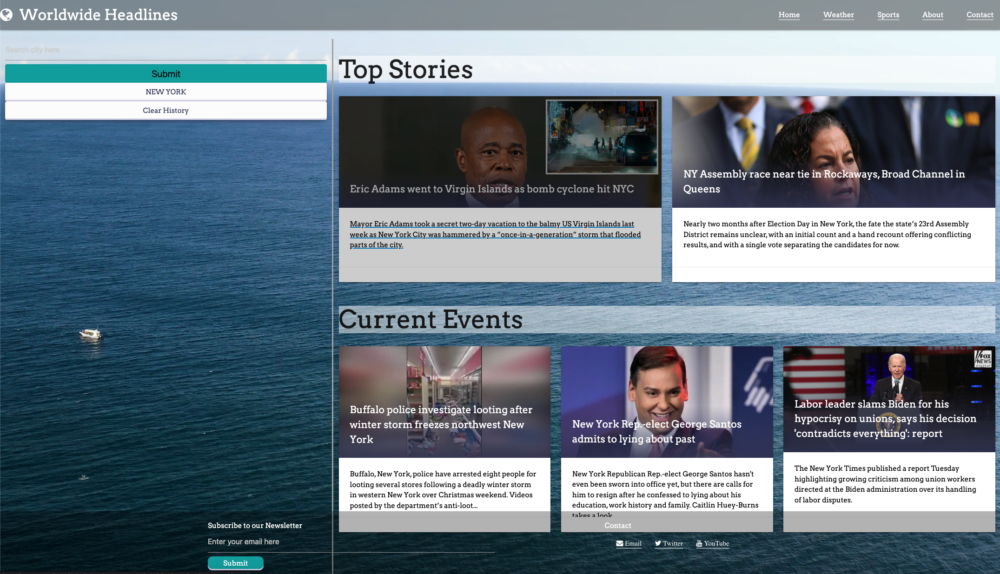

## Table of contents
​
- [Overview](#overview)
  - [Description](#description)
  - [Screenshot](#screenshot)
  - [Links](#links)
- [My process](#my-process)
  - [Built with](#built-with)
  - [What I learned](#what-i-learned)

​
​## Overview
​
### Description

For Group Project #1 we were assigned to create an application that solves a real-world problem that uses a CSS framework other than Bootstrap, two or more server-side APIs, client-side storage to store persistent data, and is interactive/ responsive. 

We built an application that will bring users top news and current events in one centralized place. This solves the problem of having to go to multiple sources and saves users' time from their busy schedule to get the latest news. 
​
### Screenshot
​

​
​
### Links
​
- GitHub URL: [https://github.com/hong-f/worldwidenews]
- Live Site URL: [https://hong-f.github.io/worldwidenews/]
​
## Our process
First, we drafted by wireframing how we wanted the application to look. Then, we created user stories to define our requirements before building. We then started building out the HTML/CSS skeleton of the page before getting into the JavaScript.

When building out the HTML/CSS skeleton, we wanted to ensure that the content can be dyanmic when displayed from the API calls by creating empty containers. In addition, we used Materialize as our CSS framework to style our application. For the JavaScript piece of the work, we leaned JQUERY to help our page to be interactive. 

### Built with
​
- HTML, CSS, JavaScript, Materialize, JQuery, Google Fonts, Font Awesome, Third Party APIs (e.g., Gnews, Current)
​
​
### What we learned
​
During this group project, we feel more familiarized with  merging branches/resolvings issues with branches. We also learned a new CSS framework, Materialize, which we had to lean heavily on documentation to use on our application. In addition, we learned leverage Fontawesome (3rd party web API) to add in a page loader for a seamless user experience. Lastly, we learned sometimes building out the HTML framework of how we want content to be displayed first then using that framework to build out the JavaScript is helpful. 
​

